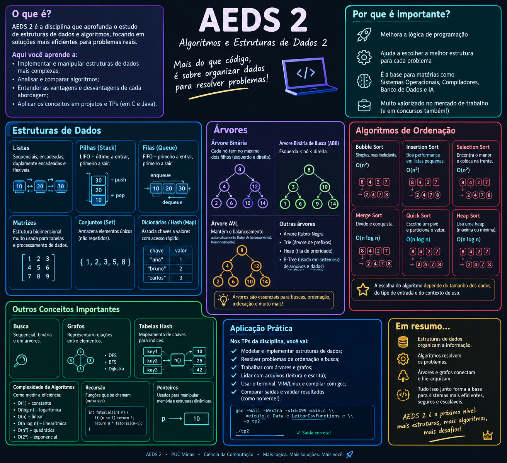

## 📚 AEDS 2

> **Algoritmos e Estruturas de Dados II** — estudo e implementação de estruturas de dados, algoritmos e técnicas de análise de complexidade.

<p align="center">
  
</p>

### 🧠 Conteúdos

Ao longo da disciplina, são trabalhados conceitos fundamentais para a construção e análise de algoritmos eficientes, com implementação principalmente em **C** e **Java**.

* 🔢 **Análise de algoritmos e complexidade**

  * Somatórios
  * Fórmulas fechadas
  * Indução matemática
  * Notação assintótica — **Θ**

* 🔗 **Estruturas de dados lineares**

  * Listas
  * Pilhas
  * Filas
  * Listas sequenciais e encadeadas

* 🌳 **Estruturas hierárquicas**

  * Árvores
  * Árvores binárias
  * Operações de inserção, busca e remoção

* 🔀 **Algoritmos de ordenação**

  * Análise de diferentes estratégias de ordenação
  * Comparação de complexidade
  * Implementação e testes

* 🔎 **Algoritmos de busca**

  * Busca sequencial
  * Busca binária

### 💻 Linguagens e ferramentas

<p align="center">
  
</p>

### 📂 Organização

O repositório reúne as atividades práticas e implementações desenvolvidas durante a disciplina, incluindo os **Trabalhos Práticos (TPs)** e seus respectivos exercícios.

```text
AEDS-2/
├── TPS/
│   ├── TP1/
│   ├── TP2/
│   └── TP3/
├── README.md
└── ...
```

> 🎯 **Objetivo:** desenvolver a capacidade de analisar problemas, escolher estruturas de dados adequadas, implementar algoritmos e avaliar sua eficiência.